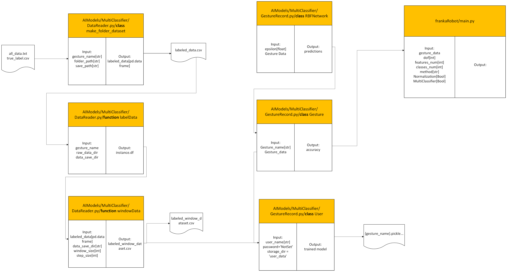

# Backend Code Handbook

This is the handbook of our system for reference. It contains the whole pipeline overview and information for every script inside our system like hyperparameter meanings, script interfaces, etc..

[TOC]

## Algorithm Pipeline

## Scripts Description

### /frankaRobot

#### /frankaRobot/main.py

##### - Overview

This script is the main script for our system's real-time deployment. In this script, we subscribe to the robot data topic, pass them into our contact detector,  publish the detector result, and save them with another saving node as well. 

##### - Hyperparameters

> R - Related to other files (Should be changed together or malfunction), I - Independent(Can be changed only in this file)

- `window_length`[int]: Detect window length (R)

- `dof`[int]: Robot degree of freedom, same as joint number (R)

- `features_num`[int]: Number of features used in models (R)

- `class_num`[int]: Number of target classes in basic touch type classifier (R)

- `Normalization`[Bool]: Flag used to control whether to conduct normalization during deployment (R)

- ------

-  `method`[str]: chose the method to deploy(I)
- 'KNN': KNN methods
  
- 'RNN': RNN methods including LSTM, GRU, and Liquid Neural Network
  
- 'TCNN': Brute combines time domain data into T-Image and uses CNN for training, matrix dimension: (window_len, dof, feature_num)
  
- 'Freq': Frequency methods including different network structures and different input

- `type_network`[str]: Sub-selector under methods to specify what inner procedure or network structure is(I)

  - RNN method
    - 'LSTM': Single layer LSTM network structure
    - 'GRU': Single layer GRU network
    - 'FCLTC': Fully connected network with Liquid Time-Constant neurons
    - 'FCCfC': Fully connected network with Closed-Form Continuous-Time neurons
    - ‘NCPLTC’: Neural Circuit Policy Network structure with Liquid Time-Constant neurons
    - 'NCPCfC': Neural Circuit Policy Network structure with Closed-Form Continuous-Time neurons
  - TCNN method
    - '1L3DTCNN': 1 Layer 3D CNN
    - '2L3DTCNN': 2 Layer 3D CNN
  - Frequency methods
    - '2LCNN': 2 Layers 2D CNN
    - '3LCNN': 3 Layers 2D CNN
    - '2L3DCNN': 2 Layers 3D CNN for Spectrogram
    - 'T2L3DCNN': 2 Layers 3D CNN for fake Spectrogram (column as raw time signal without frequency transform)
  
- `model_path_relative`[str]: combine the main path and the related path of stored models(I)

  ------

- `MultiClassifier`[Bool]: Flag used to control whether use only basic touch_type classifier methods or advanced multi classifiers methods(I)

##### - I/O Interfaces

- No I/O interface for this file

##### - Algorithm Description

- To be finished

#### /frankaRobot/ImportModel.py

##### - Overview

This is an assisting script used by main.py to import the network structures during real-time deployment. 

##### - Hyperparameters

> All the hyperparameters and network structures should be kept the same as in the training procedure

- `num_features`: Number of features used in models
- `num_classes`: Number of target classes in basic touch type classifier
- `time_window`: Detect window length

##### - I/O Interfaces

- *Function* `import_rnn_models`
  - Input: PATH[str], network_type[str], num_classes[int], num_features[int], time_window[int]
  - Output: `model.eval()`
- *Function* `import_cnn_models`
  - Input: PATH[str], network_type[str], num_classes[int]
  - Output: `model.eval()`
- *Function* `import_tcnn_models`
  - Input: PATH[str], network_type[str], num_classes[int], num_features[int], time_window[int]
  - Output: `model.eval()`

##### - Algorithm Description

- To be Finished

### /AIModels

##### /AIModels/RNNmodel.py

##### - Overview

##### - Hyperparameters

##### - I/O Interfaces

##### - Algorithm Description

### /AIModels/MultiClassifier

#### /AIModels/MultiClassifier/GestureRecord.py

##### - Overview

This script is the core script of multi-classifier pipeline training. It establishes the  User instance and Gesture instance under User instance as well as the RBFNetwork instance attached to each Gesture instance.

##### - Hyperparameters

> R - Related to other files (Should be changed together or malfunction), I - Independent(Can be changed only in this file)

- `window_length`[int]: Detect window length (R)
- `step_size`[int]: window sliding step size when obtaining windowed data from raw data for training(R)
- `dof`[int]: Robot degree of freedom, same as joint number (R)

- `features_num`[int]: Number of features used in models (R)

- `flatten_mode`[str]:

##### - I/O Interfaces

##### - Algorithm Description

#### /AIModels/MultiClassifier/DataReader.py

##### - Overview

##### - Hyperparameters

##### - I/O Interfaces

##### - Algorithm Description

 